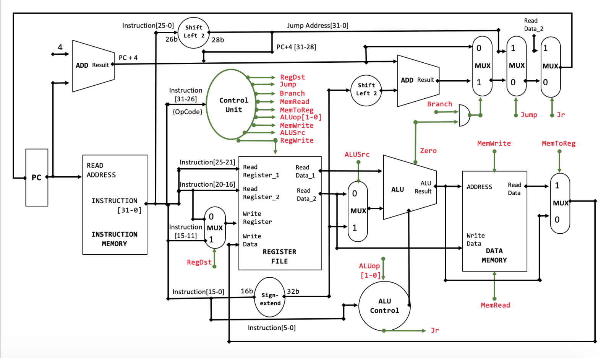
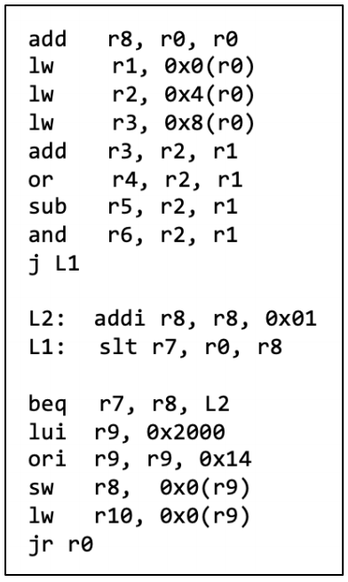

# VHDL Desing and Simulation of a 32-bit MIPS Processor

Final project for the Computer Architecture class, ITESM fall 2019

## Block diagram of MIPS processor

Each block was implemeted as a vhd module



### Implemented instructions 
* R-type instructions (add, sub, and, or, etc.)
* Jump
* Beq
* Addi
* Ori
* Lui
* Lw
* Sw

## Simulation testing

In order to test the MIPS processor, the following Assembly code was used



The instructions were translated to Machine Code and added to the instruction memory 

```vhdl
variable ROM_MEMORY : REG_BANK := (
	"00000000000000000100000000100000", -- add r8, r0, r0
	"10001100000000010000000000000000", -- lw r1, 0x0(r0)
	"10001100000000100000000000000100", -- lw r2, 0x4(r0)
	"10001100000000110000000000001000", -- lw r3, 0x8(r0)
	"00000000010000010001100000100000", -- add r3, r2, r1
	"00000000010000010010000000100101", -- or r4, r2, r1
	"00000000010000010010100000100010", -- sub r5, r2, r1
	"00000000010000010011000000100100", -- and r6, r2, r1
	"00001000000000000000000000001010", -- j L1
	"00100001000010000000000000000001", -- L2: addi r8, r8, 0x01
	"00000000000010000011100000101010", -- L1: slt r7, r0, r8
	"00010000111010001111111111111101", -- beq r7, r8, L2
	"00111100000010010010000000000000", -- lui r9, 0x2000
	"00110101001010010000000000010100", -- ori r9, r9, 0x14
	"10101101001010000000000000000000", -- sw r8, 0x0(r9)
	"10001101001010100000000000000000", -- lw r10, 0x0(r9)
	"00000000000000000000000000001000", -- jr r0
others  => (others  =>  '0')
);
```

To test the previous code, the following values were preloaded to the data memory

```vhdl
variable RAM_MEMORY : REG_BANK := ( 
	x"0000_0003",
	x"0000_0004",
	x"0000_0005",
	x"0000_0006",
others => (others => '0') 
);
```

### MIPS processor testbench


Paying close attention to the PC (q[31:0]) and the internal registers, based on the previous instructions and memory values preloaded, its clear how each instruction is being executed and how the registers are being modified based on the instruction

After the instructions have finished executing, the expected values for the registers are as follows:


